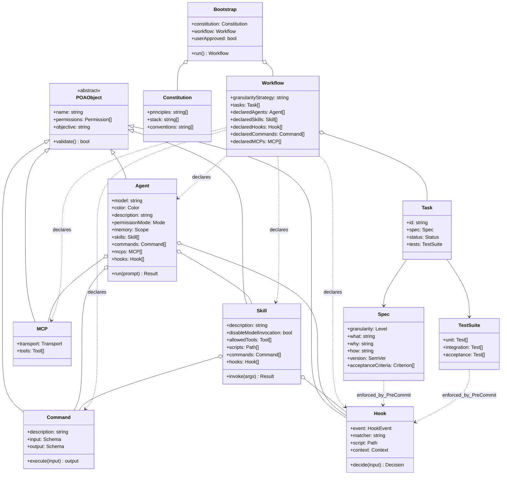

# POA — Diagrama de clases

> Programación Orientada a Agentes. Modelo conceptual de las primitivas que componen la factory y de los artefactos del contrato (Bootstrap / Constitution / Workflow / Task / Spec).

## 1. Diagrama

## 2. Notas de modelo

### 2.1 `POAObject` (clase abstracta)

Toda primitiva ejecutable comparte tres atributos:

- **`name`** — identificador único en kebab-case (constitution §5).
- **`permissions`** — lista de capacidades mínimas (least privilege, constitution §2.2.6).
- **`objective`** — frase imperativa que describe qué cumple el objeto. Se usa en `description` y en mensajes de error de hooks.

Método `validate()` chequea que los tres campos estén presentes y bien formados; se invoca por el hook `permissions-guard` al cargar la factory.

### 2.2 `Agent`

Mapea 1:1 a un archivo `.claude/agents/<name>.md`. Campos adicionales sobre `POAObject`:

- `model` — `sonnet` / `haiku` / `opus` / `inherit`.
- `color` — uno de `red`/`blue`/`green`/`yellow`/`purple`/`orange`/`pink`/`cyan`. Por convención mapea a la fase del agente (ver Workflow §3).
- `permissionMode` — `default`/`acceptEdits`/`auto`/`dontAsk`/`bypassPermissions`/`plan`.
- `memory` — `user`/`project`/`local`/`none`.
- Composición de `skills`, `commands`, `mcps`, `hooks`.

### 2.3 `Skill`

Mapea a un directorio `.claude/skills/<name>/SKILL.md`. Puede traer scripts auxiliares (Python/bash) y referenciar Commands. Si tiene efectos (escribe archivos, llama APIs), debe declarar `disableModelInvocation: true` (constitution §2.4.14).

### 2.4 `Command`

Mapea a `.claude/commands/<name>.md`. Es el equivalente al "método público" de la factory: punto de entrada explícito invocable con `/comando`. Lleva schema de `input` y `output` (informal, en markdown) para que humanos y agentes sepan qué esperar.

### 2.5 `Hook`

No tiene archivo `.md` propio: vive como script (`.claude/hooks/<name>.sh` o `.py`) más una entrada en `.claude/settings.json`. El campo `event` determina cuándo dispara (`PreToolUse`, `PostToolUse`, `UserPromptSubmit`, etc.) y `matcher` filtra.

### 2.6 `MCP`

Conector externo. Se declara en `.mcp.json` o inline en el frontmatter de un Agent. La factory base **no** trae MCPs propios; los agentes de dominio los declaran (ej. Figma para frontend, GitHub para backend).

### 2.7 Artefactos del contrato

- **`Bootstrap`** — fase única que produce `Constitution` + `Workflow`. Implementada operacionalmente por el agente `planner` + review del User (ver UC-1).
- **`Constitution`** — este archivo (`.claude/specs/constitution.md`).
- **`Workflow`** — `.claude/specs/workflow.md`. Declara la granularidad elegida y lista las Tasks. Crucialmente, también declara los Agents/Skills/Hooks/Commands/MCPs que el proyecto necesita: **toda primitiva POA debe pasar por el Workflow para existir** (constitution §2.3.11).
- **`Task`** — `.claude/specs/tasks/<id>-<slug>.md`. Unidad atómica; 1:1 con Spec.
- **`Spec`** — contrato What/Why/How versionado dentro del archivo de la Task.
- **`TestSuite`** — tests escritos por QA, paths en `tests/<level>/<task-id>__*.test.*` (constitution §2.5.17).

## 3. Invariantes derivados

Estos invariantes son consecuencia del diagrama y deben enforzarse por hooks o por Auditor:

1. **`Workflow ⇒ Components`** (constitution §2.3.11). Validado por hook `pre-spec-validate` al crear un Agent/Skill/Command/Hook nuevo: si no está declarado en `Workflow.declared*`, rechaza.
2. **`Spec ⇒ Code diff`** (constitution §2.1.2). Validado por `pre-commit-contract`: revisa que cada path tocado en el diff esté en el scope de alguna Spec activa.
3. **`Spec ⇒ Tests`** (constitution §2.5.16). Validado por `pre-commit-contract` + Auditor: cada acceptance criterion de la Spec debe tener un test correspondiente en `tests/`.
4. **`POAObject.permissions = minimal`** (constitution §2.2.6). Validado por hook `permissions-guard` al boot de Claude Code.
5. **`Spec.version monotónico`** (constitution §2.6.18-19). Validado por Auditor en `post-merge-bump`: solo el Auditor puede bumpear; humanos no.
