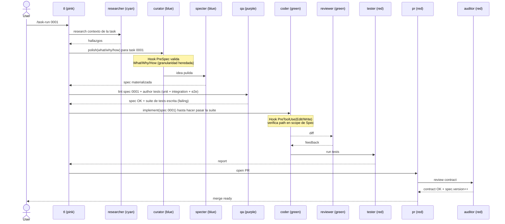
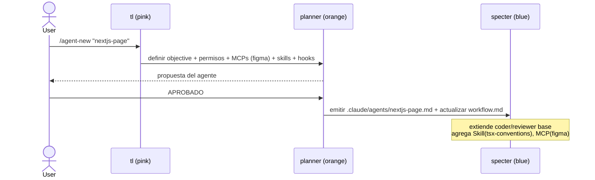

# Diagramas de secuencia — Casos de uso

> Cuatro casos de uso cubren el ciclo completo de la factory. Los colores entre paréntesis indican el `color` declarado en el frontmatter del Agent (ver constitution §3).

## UC-1 — Bootstrap del proyecto

**Trigger**: `/factory-init "<descripción del proyecto>"`.
**Salida**: `.claude/specs/prd.md`, `.claude/specs/rfc.md`, `.claude/specs/workflow.md` (derivado del RFC), `.claude/specs/constitution.md`, `.claude/specs/tasks/*.md`, skeletons de los Agents/Skills/Hooks/Commands declarados.
**Punto clave**: el Bootstrap tiene **dos gates de revisión humana** (PRD → RFC). Nada se escribe a disco hasta que ambos están aprobados.

```mermaid
sequenceDiagram
    actor User
    participant TL as tl (pink)
    participant R as researcher (cyan)
    participant P as planner (orange)
    participant S as specter (blue)
    participant FS as .claude/specs
    User->>TL: /factory-init "ML training pipeline"
    TL->>R: investiga dominio + stack + restricciones
    R-->>TL: hallazgos
    TL->>P: conduce Bootstrap (PRD → RFC)
    Note over P: Skill(draft-prd): interview de producto
    P-->>User: PRD propuesto (What/Why — problema, objetivos, requisitos)
    User-->>P: review PRD
    alt User pide ajustes al PRD
        P->>P: itera PRD (puede re-invocar researcher)
        P-->>User: PRD revisado
    end
    User->>P: Approve PRD (Gate 1)
    Note over P: Skill(draft-rfc): interview t&eacute;cnico
    Note over P: Skill(propose-agents): RFC §8 declaraci&oacute;n POA
    P-->>User: RFC propuesto (How — arquitectura + granularidad + Tasks + declaraci&oacute;n POA)
    User-->>P: review RFC (granularidad ok? §7 tasks ok? §8 POA completo?)
    alt User pide ajustes al RFC
        P->>P: itera RFC
        P-->>User: RFC revisado
    end
    User->>P: Approve RFC (Gate 2)
    Note over P: Skill(plan-workflow): deriva workflow.md desde RFC §7+§8
    P->>S: emitir prd.md + rfc.md + workflow.md + constitution.md + skeletons
    S->>FS: prd.md, rfc.md, workflow.md, constitution.md, tasks/*.md, agents/*.md, skills/**, hooks/*, commands/*
    S-->>User: bootstrap completo
```

### Detalle de Gate 1 — PRD review

El User evalúa el PRD respondiendo:

1. **Problema** — ¿captura el problema correcto? ¿Las métricas de éxito son las adecuadas?
2. **Requisitos** — ¿el P0/P1/P2 está bien priorizado? ¿Falta o sobra algo en scope?
3. **Usuarios** — ¿el segmento y las user stories son correctos?

Si cualquiera requiere ajuste, Planner re-itera el PRD. Solo con `Approve PRD` pasa a Gate 2.

### Detalle de Gate 2 — RFC review

El User evalúa el RFC respondiendo:

1. **Granularidad** (RFC §7) — ¿una Task = la unidad correcta para este proyecto? ¿La lista cubre el alcance?
2. **Diseño** (RFC §4-§6) — ¿la arquitectura es la correcta? ¿Las alternativas están documentadas?
3. **Declaración POA** (RFC §8) — ¿los agents/skills/hooks/commands propuestos son suficientes? ¿Tienen el modelo/permisos correctos?

Si cualquiera requiere ajuste, Planner re-itera el RFC. Solo con `Approve RFC` pasa a materialización.

---

## UC-2 — Implementar una Task (loop SDD por task)

**Trigger**: `/task-run <id>`.
**Salida**: PR con código + tests + Spec actualizada (si hubo bump), pasando por Auditor.
**Punto clave**: QA escribe los tests **failing** antes de que Coder implemente (TDD por defecto, spec-as-source).



### Sub-loop de tests por nivel

QA escribe tres archivos por Task:

- `tests/unit/<id>__<slug>.test.*` — uno por acceptance criterion.
- `tests/integration/<id>__<slug>.test.*` — uno por interacción con otra Task del Workflow.
- `tests/acceptance/<id>__<slug>.test.*` — uno por escenario "What" del User.

Coder no puede declarar la Task como hecha si algún test queda failing.

---

## UC-3 — Spec drift detectado en cambio fuera de scope

**Trigger**: cualquier commit local (`git commit`).
**Salida**: commit bloqueado con feedback al Coder; si el cambio era legítimo, se actualiza la Spec antes de re-intentar.
**Punto clave**: el hook `pre-commit-contract` corre el Auditor en modo verify; si el diff toca paths fuera del scope declarado de las Specs activas, el commit se rechaza con exit 2.

```mermaid
sequenceDiagram
    participant Co as coder (green)
    participant Hook as pre-commit-contract
    participant Au as auditor (red)
    participant Cu as curator (blue)
    participant Sp as specter (blue)
    Co->>Hook: git commit (diff)
    Hook->>Au: verify contract(diff)
    Au-->>Hook: drift en spec 0007 (path X fuera de scope)
    Hook-->>Co: BLOCK exit 2 "actualiz&aacute; spec 0007 o quit&aacute; el cambio"
    Co->>Cu: re-curate 0007 (nuevo scope)
    Cu->>Sp: spec actualizada
    Sp-->>Co: spec 0007 v1.1.0 (minor bump propuesto)
    Co->>Hook: git commit (retry)
    Hook->>Au: verify contract(diff)
    Au-->>Hook: contract OK (scope ampliado)
    Hook-->>Co: ALLOW exit 0
```

### Política de bumps al detectar drift

- Drift por path nuevo que extiende el contrato → **minor** propuesto por Curator, confirmado por Auditor al merge.
- Drift por path nuevo que cambia comportamiento incompatible → **major**.
- Drift por clarificación textual sin cambio de comportamiento → **patch** (suele ser refactor del Coder).

---

## UC-4 — Crear agente de dominio (Bootstrap incremental)

**Trigger**: `/agent-new "<nombre>"`.
**Salida**: `.claude/agents/<nombre>.md` aprobado por User, con sus Skills/Hooks/MCPs declarados en `Workflow.declared*`.
**Punto clave**: agregar un Agent es una mini-Bootstrap; pasa por Planner y review del User, no por Curator.



### Regla de reutilización

Un Agent de dominio **no debe duplicar la lógica** de los Agents base. La reutilización viaja por:

1. **Compartir Skills** — un `nextjs-page` puede usar las mismas Skills que `coder` para git/diff/edit.
2. **Compartir Hooks** — los hooks normativos (`pre-spec-validate`, `pre-commit-contract`) corren a nivel proyecto y aplican a todos los agents.
3. **Agregar lo específico** — solo lo único del dominio (ej. `tsx-conventions`, MCP Figma) se declara en el Agent nuevo.

Si un Agent de dominio termina con más de 5 Skills propias, probablemente está mal granularizado y debería partirse.
