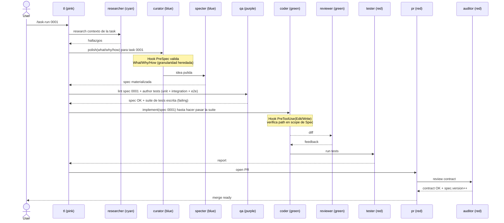
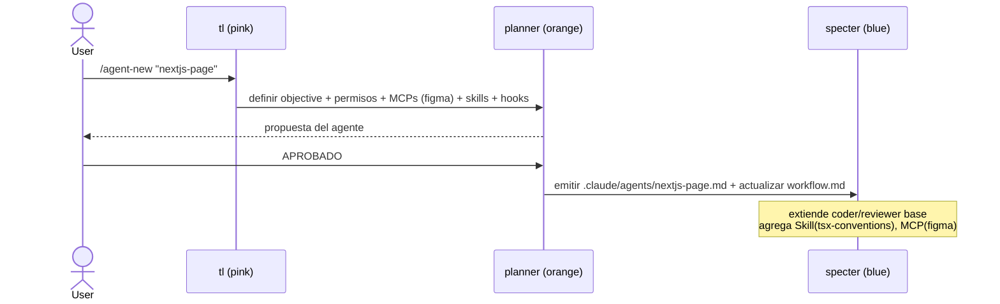

# Diagramas de secuencia — Casos de uso

> Cuatro casos de uso cubren el ciclo completo de la factory. Los colores entre paréntesis indican el `color` declarado en el frontmatter del Agent (ver constitution §3).

## UC-1 — Bootstrap del proyecto

**Trigger**: `/factory-init "<descripción del proyecto>"`.
**Salida**: `.claude/specs/constitution.md`, `.claude/specs/workflow.md`, `.claude/specs/tasks/*.md`, skeletons de los Agents/Skills/Hooks/Commands declarados.
**Punto clave**: el User aprueba el Workflow y las Tasks antes de que Specter materialice nada.

```mermaid
sequenceDiagram
    actor User
    participant TL as tl (pink)
    participant R as researcher (cyan)
    participant P as planner (orange)
    participant S as specter (blue)
    participant FS as .claude/specs
    User->>TL: /factory-init "ML training pipeline"
    TL->>R: investiga dominio + stack + restricciones
    R-->>TL: hallazgos
    TL->>P: define Workflow (What/Why + How + granularidad + agents/skills/hooks/commands/MCPs)
    P-->>User: propone Workflow + Tasks + cat&aacute;logo de agents
    User-->>P: review (granularidad ok? tasks ok? agents ok?)
    alt User pide ajustes
        P->>P: itera (puede re-invocar researcher)
        P-->>User: nueva propuesta
    end
    User->>P: APROBADO
    P->>S: emitir Constitution + Workflow + skeletons de Tasks
    S->>FS: constitution.md, workflow.md, tasks/*.md, agents/*.md, skills/**, hooks/*, commands/*
    S-->>User: bootstrap completo
```

### Detalle de la review

El User responde tres preguntas explícitas:

1. **Granularidad** — ¿una Task = una página/endpoint/etapa/función? ¿Es el nivel correcto para este proyecto?
2. **Tasks** — ¿la lista cubre el alcance? ¿Faltan o sobran?
3. **Agents** — ¿los agents de dominio propuestos son suficientes? ¿Cada uno tiene el MCP/skill correcto?

Si cualquiera devuelve "no", Planner re-itera. Solo con "APROBADO" en las tres pasa a Specter.

---

## UC-2 — Implementar una Task (loop SDD por task)

**Trigger**: `/task-run <id>`.
**Salida**: PR con código + tests + Spec actualizada (si hubo bump), pasando por Auditor.
**Punto clave**: QA escribe los tests **failing** antes de que Coder implemente (TDD por defecto, spec-as-source).



### Sub-loop de tests por nivel

QA escribe tres archivos por Task:

- `tests/unit/<id>__<slug>.test.*` — uno por acceptance criterion.
- `tests/integration/<id>__<slug>.test.*` — uno por interacción con otra Task del Workflow.
- `tests/acceptance/<id>__<slug>.test.*` — uno por escenario "What" del User.

Coder no puede declarar la Task como hecha si algún test queda failing.

---

## UC-3 — Spec drift detectado en cambio fuera de scope

**Trigger**: cualquier commit local (`git commit`).
**Salida**: commit bloqueado con feedback al Coder; si el cambio era legítimo, se actualiza la Spec antes de re-intentar.
**Punto clave**: el hook `pre-commit-contract` corre el Auditor en modo verify; si el diff toca paths fuera del scope declarado de las Specs activas, el commit se rechaza con exit 2.

```mermaid
sequenceDiagram
    participant Co as coder (green)
    participant Hook as pre-commit-contract
    participant Au as auditor (red)
    participant Cu as curator (blue)
    participant Sp as specter (blue)
    Co->>Hook: git commit (diff)
    Hook->>Au: verify contract(diff)
    Au-->>Hook: drift en spec 0007 (path X fuera de scope)
    Hook-->>Co: BLOCK exit 2 "actualiz&aacute; spec 0007 o quit&aacute; el cambio"
    Co->>Cu: re-curate 0007 (nuevo scope)
    Cu->>Sp: spec actualizada
    Sp-->>Co: spec 0007 v1.1.0 (minor bump propuesto)
    Co->>Hook: git commit (retry)
    Hook->>Au: verify contract(diff)
    Au-->>Hook: contract OK (scope ampliado)
    Hook-->>Co: ALLOW exit 0
```

### Política de bumps al detectar drift

- Drift por path nuevo que extiende el contrato → **minor** propuesto por Curator, confirmado por Auditor al merge.
- Drift por path nuevo que cambia comportamiento incompatible → **major**.
- Drift por clarificación textual sin cambio de comportamiento → **patch** (suele ser refactor del Coder).

---

## UC-4 — Crear agente de dominio (Bootstrap incremental)

**Trigger**: `/agent-new "<nombre>"`.
**Salida**: `.claude/agents/<nombre>.md` aprobado por User, con sus Skills/Hooks/MCPs declarados en `Workflow.declared*`.
**Punto clave**: agregar un Agent es una mini-Bootstrap; pasa por Planner y review del User, no por Curator.



### Regla de reutilización

Un Agent de dominio **no debe duplicar la lógica** de los Agents base. La reutilización viaja por:

1. **Compartir Skills** — un `nextjs-page` puede usar las mismas Skills que `coder` para git/diff/edit.
2. **Compartir Hooks** — los hooks normativos (`pre-spec-validate`, `pre-commit-contract`) corren a nivel proyecto y aplican a todos los agents.
3. **Agregar lo específico** — solo lo único del dominio (ej. `tsx-conventions`, MCP Figma) se declara en el Agent nuevo.

Si un Agent de dominio termina con más de 5 Skills propias, probablemente está mal granularizado y debería partirse.
