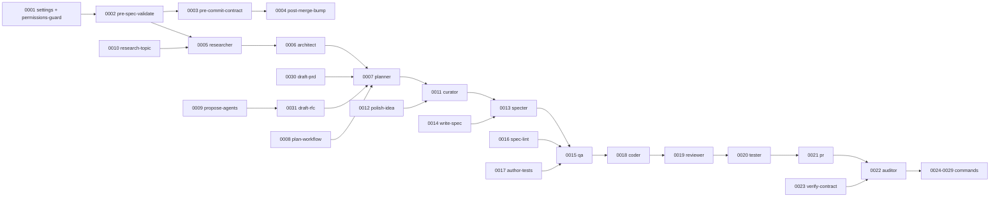

# Workflow — open-factory-spec

> Este Workflow describe **cómo se construye la propia factory**. Es un artefacto **derivado del RFC** (`.claude/specs/rfc.md`) por la skill `plan-workflow`. Una vez que el User aprueba el RFC en Gate 2 del Bootstrap, `workflow.md` se deriva y todas las Tasks listadas acá se materializan en `.claude/specs/tasks/`.
>
> **Artefactos de Bootstrap**: `prd.md` (Gate 1 — What/Why) → `rfc.md` (Gate 2 — How + granularidad + declaración POA) → **este archivo** (declarante soberano en tiempo de ejecución).

## 1. Granularidad elegida

**1 Task = 1 componente POA**.

Cada Task produce **exactamente un archivo ejecutable** de la factory:

- un Agent (`.claude/agents/<name>.md`), o
- una Skill (`.claude/skills/<name>/SKILL.md` + scripts auxiliares opcionales), o
- un Command (`.claude/commands/<name>.md`), o
- un Hook (`.claude/hooks/<name>.sh` + entrada en `.claude/settings.json`), o
- un archivo de configuración global (`.claude/settings.json`).

**Justificación**: la factory es un proyecto de meta-tooling donde cada primitiva tiene contrato propio y es testeable de forma aislada. Granularidades más gruesas (ej. "todos los agents de Specify en una Task") harían los PRs revisables y el versionado de Specs ingobernables.

## 2. Declaración POA del Workflow

### 2.1 Agents declarados (11)

| # | Agent | Capa | Color | Task |
|---|---|---|---|---|
| 1 | `researcher` | Transversal | `cyan` | 0005 |
| 2 | `architect` | Cross-cutting | `red` | 0006 |
| 3 | `planner` | Bootstrap | `orange` | 0007 |
| 4 | `curator` | Specify | `blue` | 0011 |
| 5 | `specter` | Specify | `blue` | 0013 |
| 6 | `qa` | Plan | `purple` | 0015 |
| 7 | `coder` | Implement | `green` | 0018 |
| 8 | `reviewer` | Implement | `green` | 0019 |
| 9 | `tester` | Validate | `red` | 0020 |
| 10 | `pr` | Validate | `red` | 0021 |
| 11 | `auditor` | Validate | `red` | 0022 |

### 2.2 Skills declaradas (10)

| # | Skill | Usada por | Task | `disable-model-invocation` |
|---|---|---|---|---|
| 1 | `research-topic` | researcher | 0010 | no |
| 2 | `draft-prd` | planner | 0030 | sí |
| 3 | `draft-rfc` | planner | 0031 | sí |
| 4 | `plan-workflow` | planner | 0008 | sí — deriva `workflow.md` desde el RFC aprobado |
| 5 | `propose-agents` | planner (vía draft-rfc) | 0009 | sí |
| 6 | `polish-idea` | curator | 0012 | no |
| 7 | `write-spec` | specter | 0014 | sí |
| 8 | `spec-lint` | qa | 0016 | sí |
| 9 | `author-tests` | qa | 0017 | sí |
| 10 | `verify-contract` | auditor | 0023 | sí |

### 2.3 Hooks declarados (4)

| # | Hook | Evento | Task | Bloqueante |
|---|---|---|---|---|
| 1 | `permissions-guard` | `SessionStart` | 0001 | warn (no block) |
| 2 | `pre-spec-validate` | `PreToolUse(Write)` sobre `.claude/specs/tasks/**` | 0002 | sí (exit 2) |
| 3 | `pre-commit-contract` | git pre-commit | 0003 | sí (exit 2) |
| 4 | `post-merge-bump` | git post-merge | 0004 | no (efecto) |

### 2.4 Commands declarados (6)

| # | Command | Use case | Task |
|---|---|---|---|
| 1 | `/factory-init` | UC-1 | 0024 |
| 2 | `/workflow-review` | re-abre Workflow | 0025 |
| 3 | `/task-run` | UC-2 | 0026 |
| 4 | `/agent-new` | UC-4 | 0027 |
| 5 | `/spec-new` | crea esqueleto de Spec | 0028 |
| 6 | `/spec-bump` | bumpea versión | 0029 |

### 2.5 MCPs declarados

**Ninguno en la factory base**. Los MCPs son responsabilidad de los Agents de dominio (ej. `nextjs-page` agrega Figma; `data-engineer` agrega BigQuery). La factory provee la convención de declaración pero no impone conectores.

## 3. Lista de Tasks (orden recomendado de implementación)

> El orden respeta dependencias: foundation → transversales → bootstrap → specify → plan → implement → validate → commands. Cada Task tendrá su propia Spec en `.claude/specs/tasks/<id>-<slug>.md`.

### Foundation (0001-0004)

- **0001** — `.claude/settings.json` + hook `permissions-guard` (registra los 4 hooks; arranca con permissions-guard como warning).
- **0002** — Hook `pre-spec-validate` (bash + jq). Bloquea creación de spec sin What/Why/How.
- **0003** — Hook `pre-commit-contract` (bash que delega en script Python). Bloquea commit con diff fuera de scope.
- **0004** — Hook `post-merge-bump` (bash). Llama a Auditor para bumpear `Spec.version`.

### Transversales (0005-0006)

- **0005** — Agent `researcher` (cyan). Tools: `Read`, `Grep`, `Glob`, `WebFetch`. `permissionMode: plan`. **✓ done (v0.1.0)** — see [tasks/0005-researcher-agent.md](tasks/0005-researcher-agent.md).
- **0006** — Agent `architect` (red). Tools: `Agent(*)`, `Read`. `permissionMode: default`. Sin `Agent(*)` ningún UC se puede orquestar.

### Bootstrap layer (0007-0010, 0030-0031)

- **0007** — Agent `planner` (orange). Tools: `Read`, `Agent(researcher)`, `Skill(draft-prd)`, `Skill(draft-rfc)`, `Skill(plan-workflow)`, `Skill(propose-agents)`, `Skill(research-topic)`. Conduce el Bootstrap en dos etapas con gates PRD y RFC.
- **0008** — Skill `plan-workflow` (`disable-model-invocation: true`). Deriva `workflow.md` **desde el RFC aprobado** (§7 + §8). Ya no genera el Workflow desde cero; traduce RFC → workflow.md.
- **0009** — Skill `propose-agents` (`disable-model-invocation: true`). Catálogo de agents/skills/hooks/commands/MCPs. Invocada desde `draft-rfc` al completar RFC §8.
- **0010** — Skill `research-topic`. Templating para research de dominio + stack.
- **0030** — Skill `draft-prd` (`disable-model-invocation: true`). Interview de producto → renderiza `prd.md`. Gate 1 del Bootstrap.
- **0031** — Skill `draft-rfc` (`disable-model-invocation: true`). Interview técnico → renderiza `rfc.md` (§7 granularidad + §8 declaración POA obligatorios). Gate 2 del Bootstrap.

### Specify layer (0011-0014)

- **0011** — Agent `curator` (blue). Tools: `Read`, `Skill(polish-idea)`. Heredan hook `pre-spec-validate`.
- **0012** — Skill `polish-idea`. Estructura What/Why/How por task (granularidad ya heredada).
- **0013** — Agent `specter` (blue). Tools: `Write(specs/**)`, `Skill(write-spec)`. `permissionMode: acceptEdits` para `specs/`.
- **0014** — Skill `write-spec` (`disable-model-invocation: true`). Template + versioning inicial.

### Plan layer (0015-0017)

- **0015** — Agent `qa` (purple). Tools: `Read`, `Write(tests/**)`, `Bash(<test-runner> --dry-run)`, `Skill(spec-lint)`, `Skill(author-tests)`.
- **0016** — Skill `spec-lint` (`disable-model-invocation: true`). Heurísticas: ambigüedad, testeabilidad, falta de criterios.
- **0017** — Skill `author-tests` (`disable-model-invocation: true`). Genera unit + integration + acceptance desde acceptance criteria.

### Implement layer (0018-0019)

- **0018** — Agent `coder` (green). Tools: `Edit`, `Write`, `Bash`, `Read`. Heredan hook `PreToolUse(Edit|Write)` que verifica scope.
- **0019** — Agent `reviewer` (green). Tools: `Read`, `Grep`, `Bash(git diff *)`, `Bash(git log *)`. Sin write.

### Validate layer (0020-0023)

- **0020** — Agent `tester` (red). Tools: `Bash(<test-runner> *)`, `Read`.
- **0021** — Agent `pr` (red). Tools: `Bash(gh pr *)`, `Bash(git push *)`, `Read`.
- **0022** — Agent `auditor` (red). Tools: `Read`, `Bash(git *)`, `Skill(verify-contract)`.
- **0023** — Skill `verify-contract` (`disable-model-invocation: true`). Python: compara diff vs `Spec.acceptanceCriteria` y vs `tests/` esperados.

### Commands (0024-0029)

- **0024** — Command `/factory-init`. Arranca UC-1.
- **0025** — Command `/workflow-review`. Re-abre Workflow.
- **0026** — Command `/task-run`. Arranca UC-2 sobre la Task indicada.
- **0027** — Command `/agent-new`. Arranca UC-4.
- **0028** — Command `/spec-new`. Crea esqueleto de Spec dentro de una Task.
- **0029** — Command `/spec-bump`. Helper para Auditor; humano puede usarlo en seco con `--dry-run`.

## 4. Dependencias entre Tasks (grafo)

## 5. Definition of Done por Task

Cada Task se considera completa cuando:

1. Su Spec existe en `.claude/specs/tasks/<id>-<slug>.md` con What/Why/How y acceptance criteria explícitos.
2. Sus tests (unit/integration/acceptance según aplique) existen y pasan.
3. El componente POA correspondiente está en su carpeta canónica con permisos mínimos declarados.
4. `description` del componente está validado contra los fixtures de `diagrams/invocation-fixtures.md` (si aplica matching por prompt).
5. Auditor aprobó el PR y `Spec.version` quedó bumpeada.

## 6. Riesgos identificados

- **R1 — Bootstrap recursivo**: la factory se construye con la factory. Mitigación: los primeros 0001-0006 (foundation + transversales) se materializan **a mano** (este mismo PR de blueprint los va a sentar como Specs vacías; las completamos manualmente). Recién a partir de 0007 podemos correr `/task-run` real.
- **R2 — Descripciones que no disparan**: si los fixtures de §3 de invocation-fixtures.md fallan al smoke-testear, hay que ajustar `description`. Riesgo conocido por ser nuevo Claude Code primitive.
- **R3 — Tests de la factory misma**: ¿cómo se testea un Agent? Plan: smoke-tests por prompt (matching) + ejecución de Skills aisladas (Python `pytest` para los scripts de skills con efectos).

## 7. Out of scope para este Workflow

El paquete `opftr` (en `packages/cli/`, futura migración a `@open-factory/cli` en fase D) **no es una Task POA**: es la capa de empaquetado/distribución de la factory (SPEC §13). No se declara en `Workflow.declaredAgents/Skills/Hooks/Commands` porque no compone agentes; los empaqueta. Tiene su propio README, sus propios tests, y un ciclo de release independiente del versionado de Specs.
