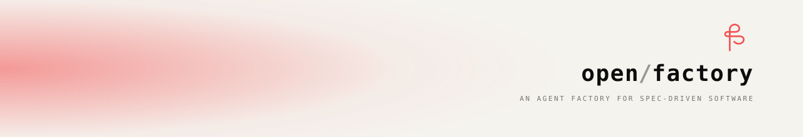

<div align="center">

<picture>
  <source media="(prefers-color-scheme: dark)" srcset=".github/assets/banner-dark.svg">
  
</picture>

<br />
<br />

<p><strong>An agent factory for Claude Code.</strong><br />
Scaffold a self-consistent <code>.claude/</code> directory — 11 agents, 8 skills, and a 5-level contract system — with one command.</p>

[](https://www.npmjs.com/package/@open-factory/cli)
[](LICENSE)
[](https://nodejs.org)

<br />

</div>

---

Our philosophy:

```text
→ specs before code, always
→ agents write code, humans approve
→ every diff needs a spec diff
→ composition over inheritance
→ least privilege by default
```

---

## See it in action

```text
You: /task-run 0001

[tl]         Orchestrating task 0001 end-to-end…
[researcher] Scanning codebase + domain context…
             ✔ context ready
[curator]    Polishing What / Why / How…
[specter]    Writing spec → .claude/specs/tasks/0001-…
             ✔ spec v0.1.0 materialized
[qa]         Linting spec · Authoring test suite…
             ✔ unit / integration / acceptance — all failing ✓
[coder]      Implementing until suite passes…
[reviewer]   Checking diff against Spec scope…
             ✔ diff in scope · no drift detected
[tester]     Running test suite…
             ✔ 12/12 passed
[auditor]    Validating Spec ↔ Code contract…
             ✔ contract OK · Spec.version bumped 0.1.0 → 0.2.0
[pr]         Opening pull request…
✔ PR #42 opened · merge ready
```

---

## Quick Start

**Requires Node ≥ 20.**

In your target project:

```bash
npx @open-factory/cli init
```

That drops a ready-to-use `.claude/` and `CLAUDE.md` into the current directory.  
Open Claude Code in the same directory and start building.

```bash
# then inside Claude Code:
/factory-init "your project description"
```

---

## What you get

| | |
|---|---|
| **11 agents** | Bootstrap · Specify · Plan · Implement · Validate + 2 transversals |
| **8 skills** | `research-topic` · `plan-workflow` · `propose-agents` · `polish-idea` · `write-spec` · `spec-lint` · `author-tests` · `verify-contract` |
| **4 hooks** | `permissions-guard` · `pre-spec-validate` · `pre-commit-contract` · `post-merge-bump` |
| **6 commands** | `/factory-init` · `/workflow-review` · `/task-run` · `/agent-new` · `/spec-new` · `/spec-bump` |
| **5-level contract** | Bootstrap → Constitution → Workflow → Task → Spec |

---

## How it works

Open Factory implements two disciplines in one system:

**SDD — Spec-Driven Development**  
The spec is the only artifact humans edit. Code is entirely generated from the spec. Every diff requires a spec diff. ([arxiv:2602.00180](https://arxiv.org/abs/2602.00180))

**POA — Agent-Oriented Programming**  
Every component (Agent, Skill, Command, Hook) is a first-class object with `name`, `permissions` (minimal), and `objective`. Composition over inheritance. Least privilege by default.

### 3 hard invariants

```text
1. Humans edit specs and approve PRs. Agents write the code.
2. Every code diff requires a corresponding Spec diff.
3. Auditor + pre-commit-contract + QA tests enforce Spec↔Code equivalence.
```

### 5 derived invariants

```text
Workflow ⇒ Components    — no component exists without Workflow declaration
Spec ⇒ Code diff         — every touched path must be in scope of an active Spec
Spec ⇒ Tests             — every acceptance criterion must have a test
POAObject.permissions = minimal
Spec.version monotonic   — only the Auditor bumps, only at merge
```

---

## Agents

| Agent | Layer | Objective |
|---|---|---|
| `planner` | Bootstrap | Define Workflow, granularity, Tasks |
| `curator` | Specify | Polish What/Why/How per Task |
| `specter` | Specify | Materialize versioned Spec to disk |
| `qa` | Plan | Lint Spec · Author 3-level failing tests |
| `coder` | Implement | Implement until QA suite passes |
| `reviewer` | Implement | Review diff against Spec |
| `tester` | Validate | Run test suite · Report results |
| `pr` | Validate | Open Pull Request |
| `auditor` | Validate | Validate Spec↔Code · Bump version |
| `researcher` | Transversal | Research domain/stack/codebase |
| `tl` | Transversal | Orchestrate all use cases end-to-end |

---

## Repo layout

```
open-factory-spec/
├── .claude/                    ← the factory itself (source of truth for templates)
│   ├── agents/                 ← 11 agent definitions
│   ├── skills/                 ← 8 skill definitions + scripts
│   ├── commands/               ← 6 command definitions
│   ├── hooks/                  ← 4 hook scripts
│   ├── specs/                  ← constitution · workflow · tasks · diagrams
│   └── settings.json           ← hook registry
├── CLAUDE.md                   ← project memory loaded by Claude Code
└── packages/
    └── cli/                    ← @open-factory/cli (zero runtime deps)
        ├── src/
        ├── scripts/sync-templates.mjs
        └── templates/          ← synced snapshot of .claude/ + CLAUDE.md
```

> The `.claude/` directory at the root **is** the template. The CLI ships a synced snapshot in `packages/cli/templates/`. One source of truth, zero duplication.

---

## Development

```bash
corepack enable          # activate pnpm if needed
pnpm install
pnpm -r build            # sync templates + compile CLI
pnpm -r test             # run tests against synced templates
node packages/cli/dist/index.js init ./tmp-test   # smoke-test
```

When you edit `.claude/` or `CLAUDE.md`, re-sync before testing:

```bash
pnpm sync
```

`pnpm -r build`, `pnpm -r test`, and `prepack` all run sync automatically.

---

## Roadmap

| Milestone | Tasks | What it unlocks |
|---|---|---|
| **A — Foundation** | 0001–0006 | 4 hooks + `researcher` + `tl` · factory can use itself |
| **B — Specify** | 0007–0014 | `planner` + `curator` + `specter` · UC-1 fully runnable |
| **C — Implement** | 0015–0019 | `qa` + `coder` + `reviewer` · UC-2 runnable to code |
| **D — Validate** | 0020–0029 | `tester` + `auditor` + `pr` + 6 commands · UC-1..4 complete |

Current status: **v0.1 — beginning of Milestone A**.

---

## Contributing

**Small fixes** — typos, clarifications, minor improvements — submit directly as a PR.

**Larger changes** — new agents, new skills, architectural changes — open an issue first so we can align on spec before any code is written. (Yes, we dogfood the process.)

**AI-generated code is welcome** — mention the agent and model used in the PR description.

---

## License

MIT © Christian Rojas Rodriguez
